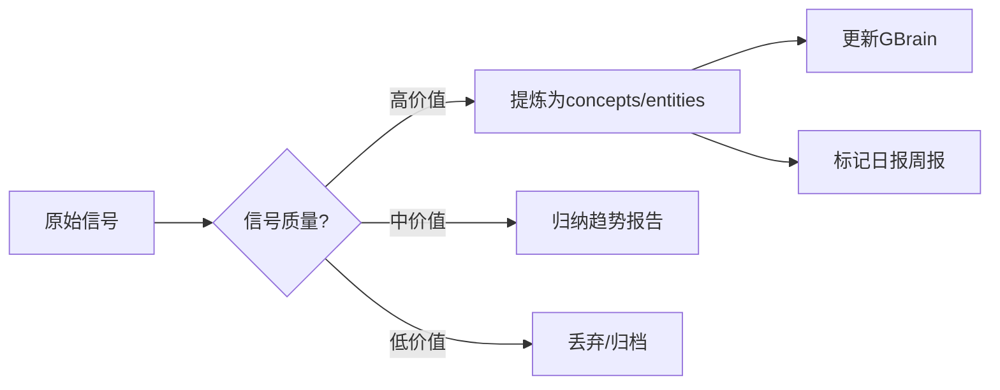

## 三、采集引擎

### 3.1 RSS 采集

**脚本**：`/root/.hermes/scripts/daily-search.py`

```python
feedparser.parse(url)  # 标准 RSS/Atom 解析
```

- 超时：12 秒/源，避免慢源拖慢整条管道
- User-Agent：标准浏览器 UA，避免被误封
- 解析结果：`{title, url, abstract, published}` 四字段格式统一

### 3.2 HTML 抓取

**函数库**：`daily-search.py` 中的爬虫函数族

| 函数 | 目标 | 解析策略 |
|------|------|---------|
| `scrape_yidaiyilu_news()` | 一带一路网 | `__NUXT__` IIFE JSON 提取 |
| `scrape_norincogroup_news()` | 兵器工业集团 | 正则匹配（CDATA导致BS4失效） |
| `scrape_spic_news()` | 国家电投 | BS4 + GBK 编码解码 |
| `scrape_catl_news()` | ★宁德时代（CATL） | BS4 HTML解析（日期间接提取） |
| `scrape_jinko_news()` | ★晶科能源（JinkoSolar） | BS4 HTML解析 + 日期嵌入清理 |
| `scrape_tongwei_news()` | ★通威集团（Tongwei） | BS4 HTML解析（日期格式YYYY年MM月DD日） |
| `scrape_tcl_news()` | ☆TCL集团 | BS4 HTML解析（新闻页无日期） |

**编码处理经验**：
- 多数国企网站返回 `ISO-8859-1` 但实际内容编码为 `utf-8` 或 `gbk/gb2312`
- 解决方法：检查 `r.encoding` → 手动用正确编码 `r.content.decode('gbk')`

### 3.3 本地采集（Windows OpenCLI）

**操作流程**：
1. Carl 在 Windows 上运行 OpenCLI 7 采集命令（22条关键词）
2. 数据按日期分目录存在 `C:\Users\Admin\Documents\LLM Wiki\收件箱：同步助手\本地采集\{YYYYMMDD}\`
3. 每日 13:00 cron 检查目录状态，有数据则统计汇报，无数据则提醒 Carl 手动跑

**PowerShell 语法注意事项**：
- 用 `[System.IO.File]::WriteAllText()` 而非 `>` 避免 UTF-16 乱码
- 每条命令用 `;` 连接成一行，方便 Carl 复制粘贴

### 3.4 深度解析

**工具**：x-reader Playwright

**触发条件**：当 RSS 信号只有标题无正文时，自动用 Playwright 展开全文

**脚本**：`deep-signal-parser` skill

---

## 四、处理管道

### 4.1 信号过滤

每条信号源采集后，经过关键词过滤器：

```
全局关键词（所有源通用）：
  出海/国际化/海外/跨境/全球/跨国/人才/培训/招聘/项目/合作

企业用人关键词（Indeed/HR源累加）：
  用人/裁员/就业/薪酬/校招/职场/人力/外籍/签证/移民/归国/海归

出海培训关键词（HR源累加）：
  跨文化/外派/属地化/全球人才/派遣/expats
```

过滤器实现：`filter_by_keywords()` 函数，标题+摘要联合匹配，大小写不敏感。

### 4.2 信号分级

每条输出信号带质量标签：

| 标签 | 定义 | 数据源 |
|------|------|--------|
| ⭐⭐⭐ | 完整标题+摘要+发布日期 | RSS 源 |
| ⭐⭐ | 标题+基础摘要/日期 | HTML 抓源泉 |
| ⭐ | 仅标题+链接 | 本地采集源 |

### 4.3 趋势聚合

日报脚本结尾包含**AI知识补充**模块，基于自有知识库补充咨询公司报告摘要（McKinsey/BCG/Deloitte 等 RSS 不可达的源）。

趋势框架（6大方向）：
1. 🏛️ 国际顶尖咨询公司视角
2. 🌏 中国企业出海深度报道
3. 🎯 出海人才与跨文化培训趋势
4. 🇬🇧 涉外英语培训与企业国际化能力建设
5. 🏗️ 央企国际化与一带一路动态

### 4.4 知识萃取（情报→知识资产）



**四步法**：
1. **扫描** — 运行 `clam-knowledge-ingestion.py` 扫描最近7天信号
2. **过滤** — 评估每条建议：新案例→entities，新方法论→concepts
3. **创建/更新** — 写入 wiki + 维护 index.md + log.md
4. **关闭循环** — 在信号源文件追加 `[已萃取] → see [[entities/xxx.md]]`

**优先级**：
- 🔴 高：央国企案例、海外新基地、竞品培训产品变化、属地化政策更新
- 🟡 中：行业趋势数据、区域用工变化、咨询公司报告摘要
- 🟢 低：通用趋势描述、同行模糊动态

---

## 五、调度系统（Cron 编排）

| 任务 | 时间 | 驱动 | 脚本 | 输出 |
|------|------|------|------|------|
| 🌅 **出海日报** | 每日 08:00 | `cron` | `daily-search.py` | 飞书群 + Dashboard |
| 📊 **情报虾周报** | 每周五 08:00 | `cron` | 情报虾 skill | 飞书群 |
| 📋 **本地采集检查** | 每日 13:00 | `cron` | 检查脚本 | 飞书群 |
| 📝 **灵感记→核心卡** | 每周日 20:00 | `cron` | `inspiration-to-corecard` skill | Obsidian vault |
| 📎 **剪藏自动摄入** | 每周一 08:00 | `cron` | `clippings-auto-ingestion` skill | raw/assets |
| 🧠 **知识卡片推送** | 工作日 09:00 | `cron` | `daily-knowledge-card.py` | 飞书群 |
| 🧹 **知识库月度巡检** | 每月1日 09:00 | `cron` | `wiki-health-check.py` | 巡检报告 |
| 🌐 **出海信息简报页** | 每日 09:00 | `cron` | `team-briefing-page` skill | yes.iai.fund |
| 📊 **Dashboard** | 持续运行 | `systemd` | `dashboard.py` | Web (port 4889) |

### Cron 编排依赖

```
08:00 日报 (daily-search.py)
  ├─ 更新 Dashboard 数据缓存
  └─ 更新简报页基础数据
09:00 简报页生成 (team-briefing-page)
  └─ 如果日报信号不足，简报页自动轮空当日
13:00 本地采集检查
  └─ 检查 Windows 端采集数据是否到位
```

### 服务维护

```
Dashboard:  python3 ~/.hermes/scripts/dashboard.py 4889 &
简报页:     python3 ~/wiki/yes.iai.fund/.scripts/build-iai-briefing.py
知识库:     ls ~/wiki/LLM\ Wiki知识应用/
看板:       ls ~/.hermes/kanban/boards/shrimp-family/kanban.db
```

---

## 六、输出渠道

### 6.1 飞书群日报（主渠道）

- **目标**：`oc_b193d7da5f447c9380df565626a03ad6`
- **格式**：板块式 Markdown，每板块显示 4-6 条匹配信号
- **内容顺序**：Tier 1 高价值源 → Tier 2 央企源 → Tier 3 本地采集 → AI 趋势补充
- **关键词标注**：每条信号尾部标注信号源简称

### 6.2 飞书群周报（情报虾）

- **目标**：`oc_b193d7da5f447c9380df565626a03ad6`
- **格式**：7大方向主题梳理 + 本周重点情报 + 数据统计
- **7大方向**：企业外语培训 / 跨文化 / 属地化 / 演讲+谈判 / 全球化人才培养 / 出海动态 / 行业英语

### 6.3 Dashboard（Web 页面）

- **端口**：4889
- **认证**：session cookie (`session=loggedin`)
- **布局**：双列（左=虾家族/复盘/灵感/客户需求；右=定时任务/周任务/日任务/出海日报）
- **文章渲染**：python-markdown 库
- **信号解析**：日报信号提取正则需与时格式同步

### 6.4 出海信息简报页

- **域名**：`yes.iai.fund`
- **数据源**：客户需求分析（收件箱：需求模拟）+ 企业出海日报（收件箱：同步助手/企业出海日报）
- **生成脚本**：`build-iai-briefing.py`
- **部署**：nginx 默认 server root → `/var/www/yes.iai.fund`

### 6.5 知识库沉淀（Obsidian LLM Wiki）

详见 `concepts/knowledge-shrimp.md`。

---

## 七、信号源扩展机制

### 7.1 发现流程

```
1️⃣ 需求捕捉 → 2️⃣ 可用性调研 → 3️⃣ 实施接入 → 4️⃣ 投产验证
```

### 7.2 候选测试步骤

1. **连通性测试**：`curl -sL --max-time 15 <url>` → 检查 HTTP 200
2. **RSS 发现**：`curl <url>/rss`、`curl <url>/feed`、`curl <url>/atom.xml`
3. **HTML 抓取可行性**：
   - 静态 HTML → 可用 requests+BS4
   - SSR (如 Nuxt `__NUXT__`) → 可用
   - JS 动态渲染 → 不可用（服务器无 headless browser）
4. **编码检测**：检查 `r.encoding`，手动验证 UTF-8/GBK 解码
5. **防爬检测**：检查 HTTP 418/403/301 重定向

### 7.3 已排坑记录

| 情况 | 处理方案 |
|------|---------|
| `r.encoding='ISO-8859-1'` 但内容为中文 | `r.content.decode('utf-8')` 或 `.decode('gbk')` |
| 页面有 `<![CDATA[` 导致 BS4 解析不到 | 改用 `re.finditer()` 正则 |
| NUXT 数据为 IIFE 格式而非直接 JSON | 提取 `return {...}` 中间的大括号 JSON |
| Nuxt SPA 页面但 SSR 返回 `__NUXT__` 数据 | 提取页面内嵌 JSON |
| 网站 WAF (HTTP 418/403) | 标记不可用，寻找替代源 |
| 网站 URL 变动/重定向 | 更新抓取路径 |
| 日报格式变更导致 Dashboard 解析失效 | 同步更新 Dashboard 正则 |

### 7.4 服务器网络限制

服务器（106.75.16.33，UCloud北京2区）出站受限：

- ✅ 可访问：国内网站、主流 RSS 源、Google/Facebook/Twitter
- ❌ 不可访问：部分海外 RSS (McKinsey/BCG/SHRM 付费源)
- ✅ 替代方案：AI 自有知识补充 + 国内镜像源

---

## 八、质量保障

### 8.1 每日检查项

- [ ] 日报是否按时推送（08:00）
- [ ] 信号源是否有空轮（某源连续3天无数据 → 排查）
- [ ] 本地采集是否有新数据（13:00 检查）
- [ ] Dashboard 是否有数据显示
- [ ] 简报页是否正常渲染

### 8.2 格式变更应对

**核心风险**：信号源网站改版 → 爬虫失效 → 日报空白

**应对流程**：
1. 发现日报某板块连续3天「今日无匹配」→ 排查该源
2. 重新 curl 检查页面结构变化
3. 更新对应的 爬虫函数 / RSS 路径
4. 同步更新 Dashboard 的日报解析正则
5. 重启 Dashboard 服务：`systemctl restart dashboard`

### 8.3 服务监控

| 服务 | 健康检查方式 | 恢复操作 |
|------|-------------|---------|
| Dashboard (port 4889) | `curl http://localhost:4889/` | `python3 ~/.hermes/scripts/dashboard.py 4889 &` |
| nginx (port 80) | `systemctl status nginx` | `systemctl restart nginx` |
| 出海信息简报页 | `curl http://yes.iai.fund/` | 运行 build-iai-briefing.py |
| cron 作业 | `cronjob list` | `cronjob update ...` |

### 8.4 看板‑Cron 同步

每30分钟自动同步看板状态 → cron 任务状态：

- 脚本：`~/.hermes/scripts/kanban-sync.py`
- 逻辑：同步活跃任务到看板卡片，已完成任务保留 24h 后归档
- 通知：看板操作通过飞书自动通知

---

## 九、技术栈与关键配置

### 脚本路径

| 组件 | 路径 |
|------|------|
| 日报引擎 | `~/.hermes/scripts/daily-search.py` |
| Dashboard | `~/.hermes/scripts/dashboard.py` |
| 简报页生成 | `~/wiki/yes.iai.fund/.scripts/build-iai-briefing.py` |
| 看板同步 | `~/.hermes/scripts/kanban-sync.py` |
| 深度解析 | `skill:deep-signal-parser` |
| 本地采集检查 | `cron:4158fc24af47` |

### Python 依赖

- 标准：`requests`, `feedparser`, `beautifulsoup4`, `lxml`
- Dashboard 额外：无（纯 http.server）
- 简报页额外：`markdown` 库

### 关键文件

| 文件 | 用途 |
|------|------|
| `~/.hermes/skills/training-product-design/SKILL.md` | 信号源扩展方法论 |
| `~/.hermes/skills/企业出海日报 🦐 — BuilderPulse 式每日信号/SKILL.md` | 日报 skill |
| `~/.hermes/skills/情报虾 🦐 — 企业国际化人才情报/SKILL.md` | 周报 skill |
| `~/wiki/LLM Wiki知识应用/concepts/intelligence-collection-pipeline.md` | 本文档 |
| `~/wiki/信息情报收集链路思路.md` | 核心卡入口 |

---

## 十、版本与变更日志

| 日期 | 变更 | 说明 |
|------|------|------|
| 2026-05-10 | 创建 | 初始版本，涵盖6个新增信号源及完整管道设计 |
| 2026-05-10 | 扩展至29个信号源 | 新增4个民企源（宁德时代/晶科/通威/TCL）+ 已尝试但不可接入民企排坑 |
| - | - | 下次更新请在此追加 |
