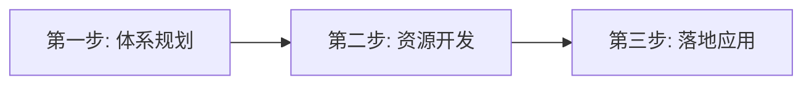

# 天元鸿鼎人才培养方法论框架（跨领域可复用）

> **来源**: 天元鸿鼎公众号（北京天元鸿鼎管理咨询有限公司），135篇建工行业人才培养文章，经轻量萃取后合并
> **范围**: 约18篇方法论文章 → 精读6篇高价值文章 → 合并为本实体
> **萃取时间**: 2026-05-09
> **用途说明**: 原始内容聚焦建工行业，以下方法论框架已剥离行业细节，保留跨领域可复用的通用方法论模板

---

## 一、全景：八大方法论框架速览

| 编号 | 方法论框架 | 核心模型 | 最佳适用场景 |
|------|-----------|---------|-------------|
| 1 | **学习地图开发** | TCL模型 / 三省三有一心 | 关键岗位人才培养体系搭建 |
| 2 | **人才培养三步走** | 体系规划→资源开发→落地应用 | 从0到1搭建人才发展体系 |
| 3 | **关键岗位系统化培养** | 五环节闭环（任职资格→现状摸底→课程开发→分层实施→评估） | 项目经理/产品经理等关键岗位系统培养 |
| 4 | **内训师激活体系** | 系统规划→培训计划牵引→定期分享机制 | 解决"培养用不起来"的痛点 |
| 5 | **学习型组织构建** | 113314框架 | 组织学习能力系统建设 |
| 6 | **企业大学从0到1** | 一三五发展路径 + 七大专业能力 | 企业大学/企业培训中心建设 |
| 7 | **经验萃取与共享机制** | 还原场景→提取关键→明确范围 | 组织经验沉淀与知识管理 |
| 8 | **敏捷课程体系搭建** | 2天2晚工作坊共创法 | 快速搭建新人/转岗培训课程体系 |

---

## 二、核心方法论框架详解

### 框架1：学习地图开发方法论

> **来源**: 《人才强企，从战略地图到学习地图》(2022-04-30)、《建工企业商务人才纵向培养模式三步走》(2022-01-14)

#### 核心理念

学习地图是基于员工的职业生涯发展规划和能力发展路径设计的一系列学习活动，旨在帮助提高人均效益。本质是**从业务战略到人才战略的解码工具**。

#### 职业生涯双路径

| 路径类型 | 说明 | 适用人群 |
|---------|------|---------|
| **一字型（垂直发展）** | 在专业领域纵深发展，如从初级→中级→高级→专家 | 专业技术人才 |
| **Y字型（横向发展）** | 某一领域深耕后适度轮岗，培养复合型人才 | 管理人才/跨界人才 |

#### TCL模型（打造内生型人才供应链）

1. **T - 学习发展体系 (Training System)**
   - 回答：学什么？怎么学？什么时候学？
   - 来源于：素质模型 × 技能要求 × 知识体系 × 经验积累
   - 原则：**干什么学什么，缺什么补什么，急用先学，立竿见影**

2. **C - 能力发展路径 (Career Path)**
   - 从新手→上手（跑步上岗）→能手→高手
   - 新手→上手：解决胜任力问题
   - 上手→能手/高手：解决绩效提升问题

3. **L - 学习活动设计 (Learning Activities)**
   - **721法则**: 10%课堂培训 + 20%高手交流 + 70%工作实践
   - 三种学习方式混合：自学（课程/书籍）+ 脱产（集中面授/工作坊）+ 在岗（导师辅导/挑战性任务）

#### 知识切割的两个核心原则

学习地图开发中最难的不是绘制地图本身，而是**知识边界的确定与知识切割**：

| 原则 | 说明 | 示例 |
|------|------|------|
| **针对性** | 围绕业务问题展开，解决具体工作场景中的实际问题 | 不是讲"谈判技巧概论"，而是讲"投标阶段如何发现并利用工程量差异" |
| **边界性** | 同一知识点对不同层级学员切割不同内容，不"给原材料" | 初级员工学"索赔工程量的计算"，中高级学"索赔策划与协同" |

#### 学习运营三步走（三省三有一心框架）

**三个省（对组织）**：
1. 省钱 - 省去学习地图开发费用
2. 省时 - 省去高质量开发的时间
3. 省力 - 省去开发过程中的人员投入

**三个有（对学员）**：
1. **让学习有方向** - 搭建专业培训体系，绘制岗位进阶地图
2. **让学习有结果** - 以业务为导向，以解决问题为目标
3. **让学习有效率** - 运营手段增强体验感和参与感

**一中心（底层理念）**：始终以学员为中心

#### 学员投入三层设计

| 投入层次 | 设计策略 | 具体手段 |
|---------|---------|---------|
| **情感投入**（我愿意） | 个性化账户设计 | 个人学习地图、个人主页、学习数据 |
| **行为投入**（我去做） | 游戏化学习任务 | 闯关解锁、任务抓手、即时奖励 |
| **认知投入**（我知道是我自己做的） | 测-学-练-考-评一体化 | 测评→录播学习→练习→阶段考试→评比排名 |

#### 衡量人才效益的三大数据指标

| 指标 | 公式 | 说明 |
|------|------|------|
| 人均产值 | 全年营业收入 ÷ 全职员工人数 | 衡量生产效率 |
| 人均利润 | 全年税后利润 ÷ 全职员工人数 | 衡量盈利效率 |
| 人工成本投入产出比 | 总产值（或利润）÷ 总人工成本 | 衡量人才投资回报率 |

---

### 框架2：人才培养三步走模型

> **来源**: 《三步搞定建企商务人才培养》(2023-03-03)

这是一个从系统角度解决人才培养问题的通用三步法：



#### 第一步：体系规划

- **做什么**：对人才学习发展体系做系统设计
- **关键产出**：
  - 梳理并打通人才成长路径
  - 明确各阶段学习内容（课程、案例、在岗任务等）
  - 确定学习方式（线上/线下/混合/导师带教等）
  - 设计认证考核方式（考试、述能、演练、导师鉴定）
- **推荐工具**：《学习地图开发》（系统完整）或《课程体系梳理》（快速轻量）

#### 第二步：资源开发

- **做什么**：围绕学习地图或课程体系，组织开展资源建设
- **关键产出**：
  - 课程开发
  - 讲师培养
  - 案例开发
  - 导师培养
  - 训练手册/工具开发
- **原则**：先规划后开发，以终为始。围绕体系做开发，内训师自然能用起来

#### 第三步：落地应用

- **做什么**：按体系规划应用资源，设计运营各类学习项目
- **关键产出**：
  - 线上学习项目运营
  - 线下学习项目运营
  - 混合学习项目运营
  - 导师带徒执行
  - 阶段认证考核

---

### 框架3：关键岗位系统化培养五环节

> **来源**: 《建企项目经理系统化培养思路》(2023-04-05)

针对关键岗位（如项目经理、产品经理、区域负责人等）的系统化培养闭环：

```
任职资格建立 → 队伍现状摸底 → 课程讲师开发 → 分层培训实施 → 培训项目评估
```

#### 环节1：任职资格建立

明确关键岗位的任职标准，包括角色定位、核心职责、能力要求。

#### 环节2：队伍现状摸底

- 使用**冰山模型**（麦克利兰）作为理论基础
- 从三个维度测评：**能力（能不能）+ 个性（合不合）+ 动力（愿不愿）**
- 产出：全面支撑和预测与高绩效相关的工作行为，发掘人才的动力需求和发展潜力

#### 环节3：课程讲师开发

围绕学习地图成果，组织开展：
- 课程开发
- 讲师培养
- 内部优秀经验沉淀和传播
- 目的：缩短培养周期、快速复制人才

#### 环节4：分层培训实施

针对不同阶段学员设计差异化培养目标：

| 阶段 | 培养目标 |
|------|---------|
| **储备期** | 掌握角色定位、业务流程及关键任务所需知识技能 |
| **新任期** | 转变角色、适应岗位 |
| **在岗期** | 解决现存问题、弥补自身短板 |
| **绩优期** | 提升思维、打开格局，沉淀经验为组织智慧 |

#### 环节5：培训项目评估

构建多维度考核评估体系：
- 考试成绩
- 课堂表现
- 发展任务完成情况
- 导师评价

---

### 框架4：内训师激活体系（解决"用不起来"的痛点）

> **来源**: 《培养了大批内训师，用不起来，怎么办？》(2023-03-03)

很多企业培养了大量内训师却用不起来，核心原因是**先培养后规划**（为培养而培养）。解决之道是**从需求端出发**。

#### 三条激活路径

| 路径 | 核心理念 | 操作步骤 |
|------|---------|---------|
| **路径1：系统规划驱动** | 从业务战略出发，先确定"谁需要上什么课" | 业务战略→人才战略→关键岗位→课程体系→内训师人选→课程开发+TTT赋能 |
| **路径2：培训计划牵引** | 围绕年度培训计划反向拉动内训师 | 年度培训班需求调研→梳理所需内部课程→组织课程开发工作坊→当年即用 |
| **路径3：定期分享机制** | 快速建队伍+常态化分享 | 工作坊培养→按周/月安排直播分享→形成组织学习文化 |

#### 关键原则

- **以终为始**：课程体系先于内训师培养
- **从需求出发**：业务需要什么课，就培养什么讲师
- **训战结合**：工作坊结束即有机会上台授课

---

### 框架5：学习型组织构建（113314框架）

> **来源**: 《构建学习型组织的探索与思考》(2022-01-14)

#### 总体目标

**"把能力建在组织上"** — 让组织通过体系力量把个人优秀经验变成普适性东西，再反哺组织。

#### 三个提升要求

1. **人才复制效率**
2. **知识复制效率**
3. **文化复制效率** — 最核心：雇佣军能打赢战役，但永远无法赢得战争（因缺乏使命感和文化）

#### 四大挑战（通用化表述）

| 挑战 | 说明 |
|------|------|
| 学习资源匮乏 | 部分岗位所需知识无法从外部获取，需自行研发 |
| 人才培养速度慢 | 经验型行业依赖积累，新人上手周期长 |
| 课程匹配难 / 工学矛盾 | 培训内容与实际业务需求脱节 |
| 集中培训成本高 | 人员分散、时间冲突导致培训组织困难 |

#### 制度体系三机制

1. **约束机制** — 如学分制管理办法
2. **激励机制** — 激发学习动力
3. **运营机制** — 保障学习活动持续运转

#### 学习平台建设三大经验

1. 充分利用社会优质运营服务商
2. 坚持"为我所有与为我所用"并重
3. 契合员工对**游戏化、社交化**的需求

---

### 框架6：企业大学建设路径（从0到1）

> **来源**: 《企业大学建设实践——从0到1建设的心路历程与启示》(2022-01-21)

#### 一三五发展目标

- **一年筑基** — 搭建基础体系
- **三年实践** — 持续运营迭代
- **五年成熟** → 从内向型→过渡型→外向型企业大学

#### 七大专业能力

| 编号 | 能力 |
|------|------|
| 1 | 课程开发和培训师培训认证能力 |
| 2 | 学习项目设计和运营能力 |
| 3 | 行动学习项目设计和运营能力 |
| 4 | 组织经验输出能力 |
| 5 | 知识萃取和案例开发能力 |
| 6 | 组织学习蓝图和学习地图开发能力 |
| 7 | 企业大学建设咨询能力 |

#### 学习价值链（人才培养供应链）

```
诊断 → 方案 → 交付运营 → 成果转化 → 评估
```

**操作细节**：
- **诊断阶段**：对组织战略做分级 + 组织学习蓝图工具 → 分析岗位职责 → 针对典型问题形成培养项目
- **成果转化**：这是最容易缺失的环节，需要专门设计

#### 四类关键项目

1. **领导力项目** — 企业大学必做
2. **关键人才培养项目** — 如项目经理、产品经理等
3. **推动变革的重大学习项目** — 如新业务转型、出海人才培养等
4. **新入职员工培训** — 军训+课程+拓展

#### 专业能力建设四步法

1. **走出去** — 对标学习
2. **引进来** — 引进先进学习技术
3. **组织研修** — 学习技术高级研修班
4. **消化吸收** — 先僵化→后优化→再固化

---

### 框架7：经验萃取与共享机制

> **来源**: 《建立共享机制，加速经验整合》(2022-01-21)

#### 核心理念

个体成长如果能迅速聚合发生在其它时间和空间的经验，将极大加速组织学习。但我们常常夸大了人们从他人经验中学习的能力。

#### 经验整理的三个关键

| 原则 | 说明 |
|------|------|
| **(a) 还原场景** | 详细描述大背景和小背景：什么时间、什么地点、什么人、在干什么、遇到什么问题、怎么解决、效果如何 |
| **(b) 提取关键** | 从复杂因素中提取成本低、影响大、可复制性强的关键因素，不求大而全 |
| **(c) 明确范围** | 界定知识/技能的适用范围和适用情形，避免生搬硬套 |

#### 经验共享的三个载体

1. **组织经验库** — 按专业分类整理，便于检索
2. **在线专家专栏** — 分专业收集问题，由专家解答与讲授
3. **经验交流会** — 核心是"引导"而非"展示"：引导学员思考自己的目标、关联自己的现状、提出自己的想法、发起自己的行动

---

### 框架8：敏捷课程体系搭建方法论

> **来源**: 《化解新人培养燃眉之急，为0-1年员工提供路径清晰、贴近工作的课程》(2023-04-05)

#### 方法1：2天2晚敏捷课程体系搭建工作坊

组织各条线业务专家集中共创，快速产出：
1. 学习阶段划分
2. 各岗位在各阶段的学习资料包
3. 岗位课程清单
4. 现有学习资源梳理（标注：已有/待开发/外采；面授/录制）

**解决的核心问题**：
- 解决新员工"视觉模糊"（看不到发展路径）
- 整合组织内分散的学习资源
- 生成清晰的人力资源工作依据

#### 方法2：场景化课程开发

- **问题**：业务专家常"擅长什么讲什么"，课程质量难以评判
- **解决**：成人学习的特点是**实用性**，员工面对的是一个个工作场景，课程应围绕"这件事怎么做"来设计
- **原则**：不是讲"规范"，而是讲"在这个场景下，你应该怎么做"

---

## 三、跨领域复用建议

以下矩阵帮助快速定位适合不同培训场景的方法论：

| 你的场景 | 推荐框架 | 核心取用点 |
|----------|---------|-----------|
| 新搭建人才培养体系 | 框架1（学习地图）+ 框架2（三步走） | TCL模型 + 体系规划→资源→应用 |
| 关键岗位（如销售经理、区域负责人）系统培养 | 框架3（五环节） | 任职资格→摸底→课程→分层→评估闭环 |
| 内训师/导师队伍建设 | 框架4（激活体系） | 三条激活路径，从需求端出发 |
| 企业大学/培训中心建设 | 框架6（企业大学） | 七大能力 + 一三五目标 + 学习价值链 |
| 组织经验沉淀与知识管理 | 框架7（经验萃取） | 还原场景→提取关键→明确范围 |
| 新人/转岗快速培训 | 框架8（敏捷课程） | 2天工作坊共创 + 场景化课程开发 |
| 组织学习文化建设 | 框架5（学习型组织） | 113314框架 + 三机制 |
| 学习项目设计落地 | 框架1（运营设计） | 测-学-练-考-评 + 三层投入设计 |

---

## 四、文章来源对照

| 文章标题 | 日期 | 贡献的主要框架 |
|---------|------|---------------|
| 人才强企，从战略地图到学习地图 | 2022-04-30 | 框架1（TCL模型、721法则、人才效益指标） |
| 建工企业商务人才纵向培养模式三步走 | 2022-01-14 | 框架1（三省三有一心、知识切割、运营设计） |
| 三步搞定建企商务人才培养 | 2023-03-03 | 框架2（三步走模型） |
| 建企项目经理系统化培养思路 | 2023-04-05 | 框架3（五环节闭环） |
| 培养了大批内训师，用不起来，怎么办？ | 2023-03-03 | 框架4（三条激活路径） |
| 构建学习型组织的探索与思考 | 2022-01-14 | 框架5（113314框架） |
| 企业大学建设实践——从0到1建设的心路历程与启示 | 2022-01-21 | 框架6（一三五目标、七大能力、学习价值链） |
| 建立共享机制，加速经验整合 | 2022-01-21 | 框架7（经验萃取三原则、三载体） |
| 化解新人培养燃眉之急，为0-1年员工提供路径清晰、贴近工作的课程 | 2023-04-05 | 框架8（敏捷课程工作坊、场景化课程） |

---

> **备注**: 本实体文件为轻量萃取产物，仅保留跨领域可复用的方法论框架，已剥离建工行业专属细节。如需查阅原始行业案例背景，请参考 `~/wiki/LLM Wiki知识应用/raw/公众号/天元鸿鼎/` 目录下的对应原始文章。

---

## 关联概念

- [[深度学习萃取五层流程与方法]] - 深度学习萃取五层流程与方法
- [[tools-collection]] - 工具类实体合集
- [[cases-public-speaking]] - 涉外演讲案例
- [[cases-project-management]] - 海外项目管理案例
- [[cases-cross-culture]] - 跨文化沟通案例
